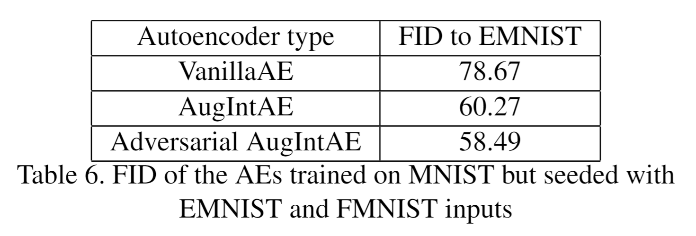
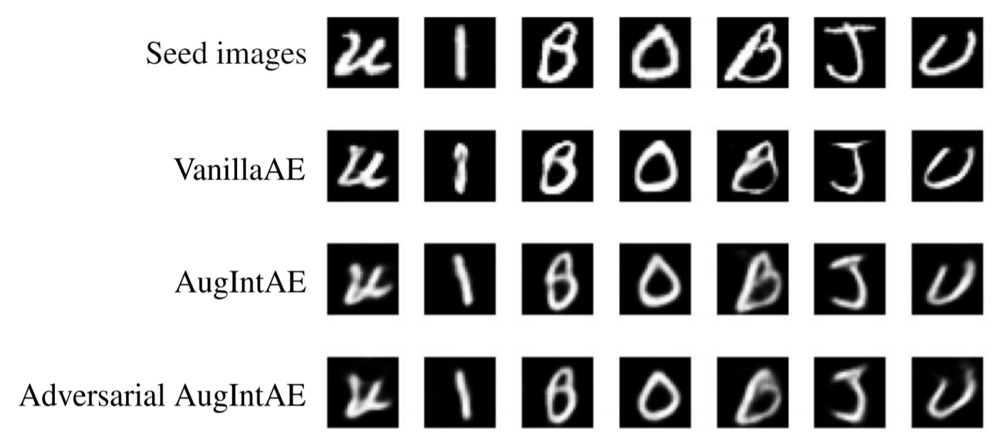

Augmentative Interpolative Autoencoder  
---
By Pierre Ebert and Daniil Lotkov.  
  
Given code is a partial implementation of the [Augmentation-Interpolative Autoencoders for Unsupervised Few-shot Image Generation](https://openreview.net/pdf?id=o2N6AYOp31) paper.    
  
**Google Colab notebook** is avaliable [here](https://colab.research.google.com/drive/1KZyoaGE60tHcIhxUaDzB-YDNMCo8qTNR?usp=sharing).  
  
**Project report PDF file** can be found [here](docs/AugIntAE_report.pdf).  

## Outline
The implemented Augmentative-Interpolative Autoencoder trained on MNIST was able to produce better results on the task of generating EMNIST letters from a seed image compared to classical AE models. The comparison holds true in terms of the distance between distributions, and while not visible to the naked eye, the internal representations of the AugIntAE are superior to those produced by purely reconstructional classical models.  

Distributions discrepancy | One-shot generation
:-------------------------:|:-------------------------:
 |   

## Abstract
The aim of this project was to develop an image generation model that, once trained on an initial domain, could generate images from a different domain based on only a few seed images of this new domain. Following the ideas of Anonymous Authors, we implemented the following autoencoders: a classical autoencoder, VanillaAE, an Augmentation-Interpolative autoencoder (AugIntAE) which comprised both random augmentation and interpolation of input images, and a second AugIntAE which incorporated an adversarial loss. All three were trained on the MNIST domain.  
  
After testing the three AEs on MNIST reconstruction and random image generation tasks, the autoencoders were given images from different domains in order to attempt a few-shot image generation. With EMNIST seeds, the Adversarial AugIntAE was superior to its competitors in terms of Fréchet Inception Distance, successfully producing relatively realistic EMNIST images from the seeds. AugIntAE also produced credible EMNIST images from the seeds, although of a lesser quality than those of the adversarial model, and VanillaAE failed to generalize successfully to this new domain. The autoencoders were unsuccessful at few-shot image generation with Fashion MNIST seeds, indicating that they are only capable of realistic few-shot generation on domains close to the original training domain.  
  